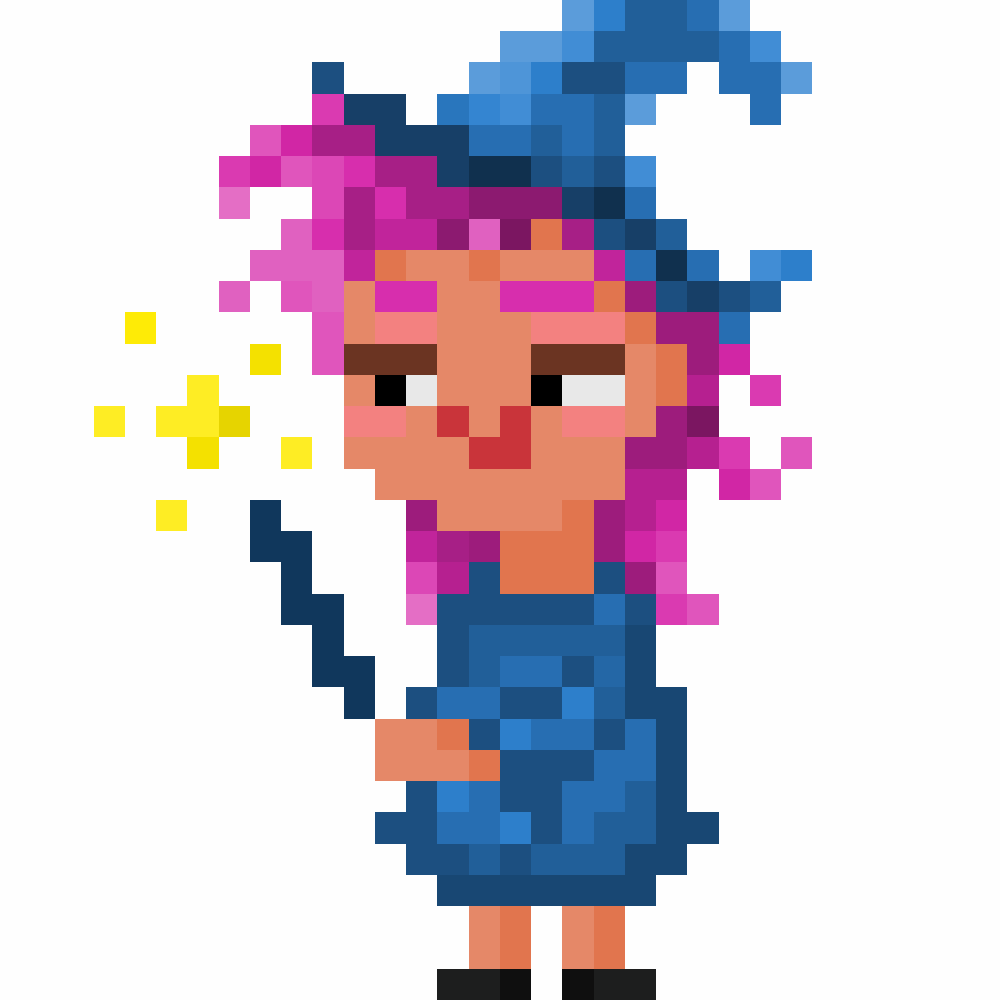
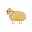

# MAigeAcademy

---

Tom ZINCK, Killian VIGUIER, Andrew MANSOUR, Theo REYNIER

---

This project is an academic project created by a group of four.
It is a chase-like minigame where a teacher needs to stop her students from being distracted by candies.

---

## States and strategies.

### Teacher 

The teacher has two main states:
* Idle: In this state, she teaches her favorite spells to her students.
* Cast: If a student is caught not paying attention and trying to sneak a candy, she casts one of her powerful spells!

She possess three main spells :
* Freeze: Freezes a student, preventing them from moving for a short period. 
* Transform: Transforms a student into an adorable sheep. Frightened, the sheep scurries back to its place. 
* Teleport: Channels her magical energy into her hands and instantly teleports a student back to their seat. 

### Student

Students have three main states:
* Idle: The student attentively listens to the teacher.
* GoToCandy: The student devises strategies to sneak candies!
* GoBackToPlace: After being hit by a spell, the student reluctantly returns to their seat.

#### Strategies

Students use various strategies to maximize their candy intake:
* Standard Strategy: The student goes back and forth to collect every candy they spot.
* EscapeTheTeacher: The student avoids the teacher at all costs while grabbing candies along their path.
* LoneWolf: This student waits for others to make a move before sneaking out alone for a candy.
* TwoByTwo: This student has a partner, and they never separate, no matter what. Beware of the teacher’s wrath!
* CandyByTime: This student waits for the perfect moment to grab a candy and immediately returns to their seat.

